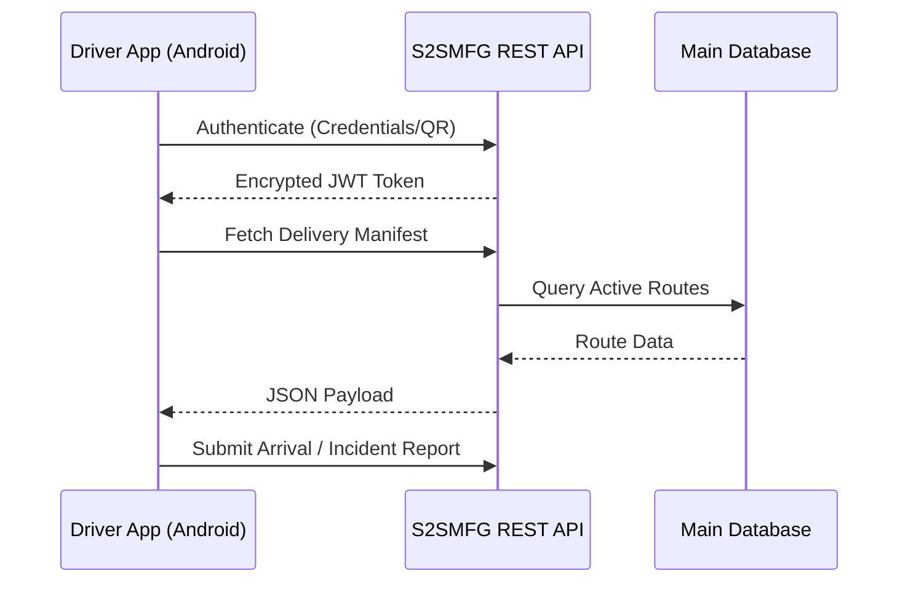

<div align="center">
  <h1>🚚 S2SMFG Logistics & Driver App</h1>
  <p><strong>A high-performance Android mobile application for real-time fleet tracking, delivery management, and secure logistics operations.</strong></p>

  [](https://flutter.dev)
  [](https://dart.dev)
  [](https://android.com)
  [](https://pub.dev/packages/get)
</div>

<br/>

## 📖 Overview

The **S2SMFG Driver App** is a native Flutter application engineered to serve as the critical mobile touchpoint for the S2SMFG manufacturing logistics network. It empowers drivers with real-time delivery manifests, secure biometric/QR authentication, and active shipment tracking—seamlessly syncing field data directly back to the centralized Laravel backend via a robust REST API.

## ✨ Core Features

* **🔐 Secure Authentication**: Multi-modal login supporting standard credentials or high-speed badge QR code scanning. Utilizes `flutter_secure_storage` for encrypted token management.
* **📦 Intelligent Delivery Plans**: Dynamic daily manifests detailing routes, priorities, and cargo specifics.
* **📷 Hardware-Accelerated Scanning**: Integrated `mobile_scanner` for lightning-fast truck QR verification, ensuring the right cargo is on the right vehicle.
* **📍 Active Trip Telemetry**: Real-time tracking of active deliveries from dispatch to destination arrival.
* **🚨 Incident Reporting**: In-app capability to report transit anomalies, equipped with camera integration (`image_picker`) for immediate photographic evidence.

## 🏗️ System Architecture



## 🛠️ Tech Stack & Tooling

- **Core Framework**: Flutter (≥ 3.11.0)
- **State Management & Routing**: `GetX` (^4.6.6) - For reactive state injection and rapid navigation.
- **Networking**: `Dio` (^5.7.0) - Powerful HTTP client with interceptors for seamless token injection.
- **Hardware Integrations**: 
  - `mobile_scanner` (^5.2.3)
  - `image_picker` (^1.1.2)

## 🚀 Getting Started

### Prerequisites
- Flutter SDK installed (Targeting Android minSdk 21).
- Active S2SMFG Driver Account.
- Network access to the S2SMFG production API environment.

### Installation & Build

1. **Clone the repository**
   ```bash
   git clone https://github.com/IT-MadaWikriPSG/Driver-S2SMFG.git
   cd flutter-driverapp-s2smfg
   ```

2. **Fetch Dependencies**
   ```bash
   flutter pub get
   ```

3. **Build the Application**
   ```bash
   # Build a debug APK for emulator/local testing
   flutter build apk --debug

   # Build a highly optimized release APK for distribution
   flutter build apk --release
   ```
   *The compiled binary will be generated at `build/app/outputs/flutter-apk/app-release.apk`.*

## ⚙️ Configuration

The application communicates with the backend via predefined REST endpoints. Core network settings are centralized in `lib/app/constants/api_constants.dart`.

Ensure the `BASE_URL` points to the correct environment (e.g., `https://s2smfg.madawikri.co.id/api`) before compiling the release build.

## 🔗 Related Ecosystem

This application is an integral node of the S2SMFG ecosystem:
- **Core Platform (Backend)**: [ardyansyahp/s2smfg](https://github.com/ardyansyahp/s2smfg)
- **Factory Floor App**: [ardyansyahp/flutter-webview-s2smfg](https://github.com/ardyansyahp/flutter-webview-s2smfg)

---
<div align="center">
  <sub>Built with ❤️ by the IT Mada Wikri Engineering Team.</sub>
</div>
